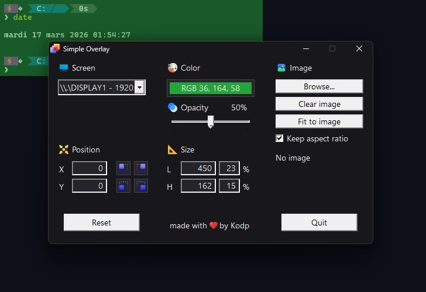
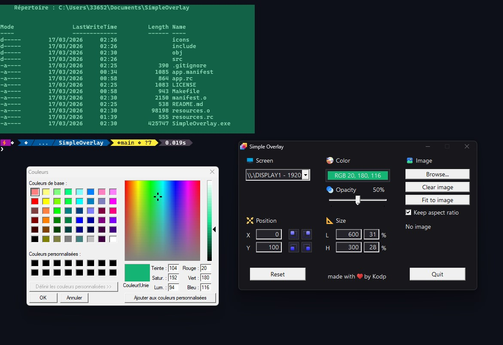
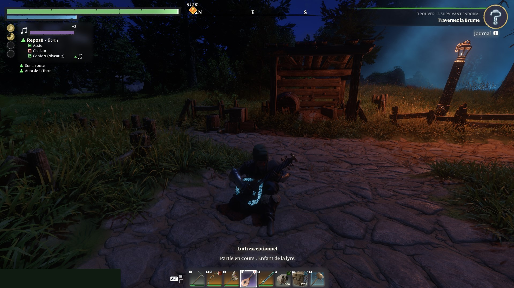
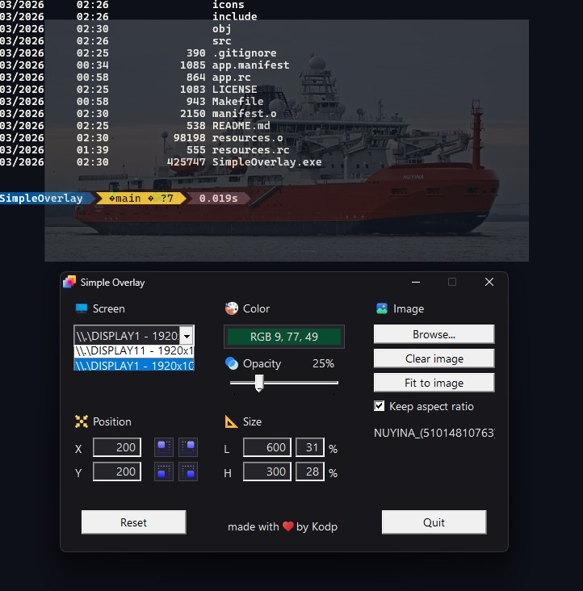
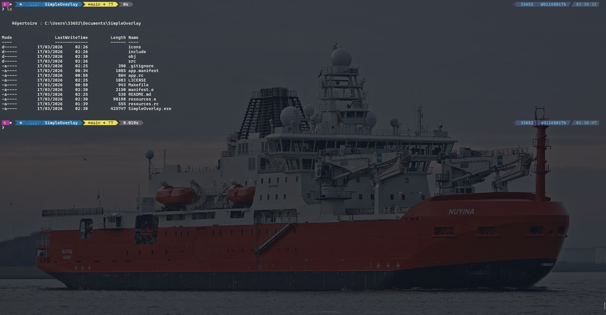

# SimpleOverlay

Lightweight native C++ Win32 overlay tool with real-time controls, multi-monitor support, and image rendering.
- Overlay is always on top
- Designed for simplicity and performance
- Ideal for games, monitoring, or custom HUDs
- Opacity control
- No dependencies (pure Win32)

Originally developed to hide an intrusive server overload warning while playing *Enshrouded*.

---

### 🎨 Colorized Overlay

### 🖼️ Image Overlay

---

### 🛠️ Dev Build Requirements
- Windows
- g++ (MinGW)

### 🧩 Credits (Icons)
<a href="https://www.flaticon.com/fr/auteurs/see-icons">See Icons - License Flaticon</a>

<a href="https://www.flaticon.com/fr/auteurs/freepik">Freepik - License Flaticon</a>

<a href="https://www.flaticon.com/authors/laisa-islam-ani">Laisa Islam Ani - License Flaticon</a>

<a href="https://www.flaticon.com/authors/hilmy-abiyyu-a">Hilmy Abiyyu A. - License Flaticon</a>

